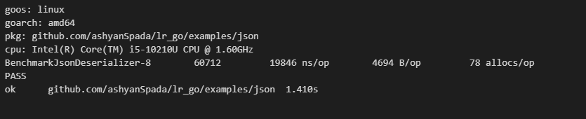
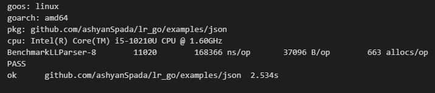
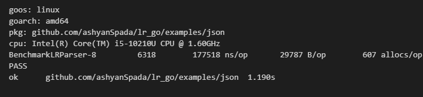

## Introduction
As we all know, there are many parser-generated techniques like Yacc, Bison and ANTLR. They are either an LL Parser or an LR Parser. Such parsers are automated. A compiler designer can easily "implement" a sophisticated parser with such automation techniques on the basis of a predefined CFG or PEG grammar. These delicate techniques facilitate the process of designing and implementation of a novel programming language. However, the majority of modern languages like Go and Rust abandoned such automation techniques and switched to a handwritten candidate. Why technologies that were prosperous decades ago are not popular today?

## Short Answers
I think there are three major reasons for the revival of handwritten parsers:

* Efficiency
* Error Tracing
* Code Optimization

## Experiment
I make an experiment here to better illustrate the three reasons listed above. The experiment is simple, deserializing a valid JSON string. Specifically, the JSON deserialization task is composed of two subtasks:
Decoding data from a JSON string
Bind the decoded data to a structured representation

The former subtask is generic, and all the JSON parsers need to accomplish it. While it is unnecessary to bind the decoded JSON data to tremendous types of data structures. For experiment purpose, it is enough to bind the data to a basic JSON representation.
JSON Representation Definition
According to the JSON specification, JSON is a data format with 6 fundamental data types, respectively, Null, Number, Boolean, String, Array, and Object. As follows, the type "JsonValue" represents a basic JSON data with six pointer fields which corresponds to the six fundamental types of the JSON format. For instance, if the instanced JsonValue indicates a "Null" JSON data, the field "Null" is assigned with the five remaining fields are null pointers.
``` go
type JsonValue struct {
 Null   any        `json:"null,omitempty"`
 Number *float64   `json:"number,omitempty"`
 Str    *string    `json:"str,omitempty"`
 Array  JsonArray  `json:"array,omitempty"`
 Object JsonObject `json:"object,omitempty"`
 Bool   *bool      `json:"bool,omitempty"`
}

type JsonArray []JsonValue
type JsonObject map[string]JsonValue
```
### Handwritten Parser
At first, I implemented a handwritten JSON parser, which is a Top-Down and Recursive descent parser. Thanks to the brief JSON Spec, the whole implementation is simple with just 170 lines of code, an entrance handler with 6 branch handlers.
``` go
const (
 NumberRegStr = "-?(0|[1-9][0-9]*)(.[0-9]+)?([eE][-+]?(0|[1-9][0-9]*))?"
 StringRegStr = `^"([^"\\\\]*|\\\\["\\\\bfnrt\/]|\\\\u[0-9a-f]{4})*"`
)

var numberReg, _ = regexp.Compile(NumberRegStr)

var stringReg, _ = regexp.Compile(StringRegStr)

type JsonDeserializerInterface interface {
 Deserialize(input string) (*JsonValue, bool)
}

type JsonDeserializer struct{}

func (j JsonDeserializer) Deserialize(input string) (*JsonValue, bool) {
 value, _, ok := j.deserialize(input)
 return value, ok
}

type DeserializerHandlerInterface = func(input string) (value *JsonValue, remaining string, ok bool)

func (j JsonDeserializer) deserialize(input string) (value *JsonValue, remaining string, ok bool) {
 for _, handler := range []DeserializerHandlerInterface{
  j.deserializeNull,
  j.deserializeNumber,
  j.deserializeBool,
  j.deserializeString,
  j.deserializeArray,
  j.deserializeObject,
 } {
  if value, remaining, ok = handler(input); ok {
   return
  }
 }
 return nil, input, false
}

func (j JsonDeserializer) deserializeNull(input string) (*JsonValue, string, bool) {
 remaining := strings.TrimSpace(input)
 if strings.HasPrefix(remaining, "null") {
  return &JsonValue{
   Null: true,
  }, remaining[4:], true
 }
 return nil, input, false
}

func (j JsonDeserializer) deserializeNumber(input string) (*JsonValue, string, bool) {
 remaining := strings.TrimSpace(input)
 loc := numberReg.FindStringIndex(remaining)
 if len(loc) == 0 || loc[0] != 0 {
  return nil, input, false
 }
 numberStr := remaining[loc[0]:loc[1]]
 number, err := strconv.ParseFloat(numberStr, 64)
 if err != nil {
  return nil, input, false
 }
 return &JsonValue{
  Number: &number,
 }, remaining[loc[1]:], true
}

func (j JsonDeserializer) deserializeBool(input string) (*JsonValue, string, bool) {
 remaining := strings.TrimSpace(input)
 var value bool
 if strings.HasPrefix(remaining, "true") {
  value = true
  return &JsonValue{
   Bool: &value,
  }, remaining[4:], true
 } else if strings.HasPrefix(remaining, "false") {
  return &JsonValue{
   Bool: &value,
  }, remaining[5:], true
 }
 return nil, input, false
}

func (j JsonDeserializer) deserializeString(input string) (*JsonValue, string, bool) {
 remaining := strings.TrimSpace(input)
 loc := stringReg.FindStringIndex(remaining)
 if len(loc) == 0 || loc[0] != 0 {
  return nil, input, false
 }
 s := remaining[1 : loc[1]-1]
 return &JsonValue{
  Str: &s,
 }, remaining[loc[1]:], true
}

func (j JsonDeserializer) deserializeArray(input string) (*JsonValue, string, bool) {
 var remaining string
 var ok bool
 if remaining, ok = j.expect(input, "["); !ok {
  return nil, input, false
 }
 var ans []JsonValue
 for {
  var value *JsonValue
  value, remaining, ok = j.deserialize(remaining)
  if !ok {
   break
  }
  ans = append(ans, *value)
  remaining, ok = j.expect(remaining, ",")
  if !ok {
   break
  }
 }
 if remaining, ok = j.expect(remaining, "]"); !ok {
  return nil, input, false
 }
 return &JsonValue{
  Array: ans,
 }, remaining, true
}

func (j JsonDeserializer) deserializeObject(input string) (*JsonValue, string, bool) {
 input = strings.TrimSpace(input)
 var remaining string
 var ok bool
 if remaining, ok = j.expect(input, "{"); !ok {
  return nil, input, false
 }
 m := make(JsonObject)
 for {
  var key *JsonValue
  var value *JsonValue
  key, remaining, ok = j.deserializeString(remaining)
  if !ok {
   break
  }
  remaining, ok = j.expect(remaining, ":")
  if !ok {
   return nil, input, false
  }
  value, remaining, ok = j.deserialize(remaining)
  if !ok {
   return nil, input, false
  }
  m[*key.Str] = *value
  remaining, ok = j.expect(remaining, ",")
  if !ok {
   break
  }
 }
 if remaining, ok = j.expect(remaining, "}"); !ok {
  return nil, input, false
 }
 return &JsonValue{
  Object: m,
 }, remaining, true
}

func (j JsonDeserializer) expect(input string, expected string) (string, bool) {
 input = strings.TrimSpace(input)
 if strings.HasPrefix(input, expected) {
  return input[len(expected):], true
 }
 return input, false
}
```

### Auto-generated
Different with the handwritten parsers, their automated rivals need to define the formal grammar and corresponding semantic actions to accomplish the deserialization task.
CFG
A standard JSON CFG is as below:
``` grammar
Json       -> Value
Array      -> LBracket ValueList RBracket | LBracket RBracket
Object     -> LCurly PairList RCurly | LCurly RCurly
PairList   -> Pair Comma PairList | Pair
ValueList  -> Value Comma ValueList | Value
Pair       -> String Colon Value
Value      -> String | Number | Object | Array | True | False
LCurly     -> "{"  
RCurly     -> "}"
LBracket   -> "\["
RBracket   -> "\]"
String     -> "^"([^"\\\\]*|\\\\["\\\\bfnrt\/]|\\\\u[0-9a-f]{4})*" "
Number     -> "-?(0|[1-9][0-9]*)(.[0-9]+)?([eE][-+]?(0|[1-9][0-9]*))?"
True       -> "true"
False      -> "false"
Null       -> "null"
Comma      -> ","
Colon      -> ":"
```
#### LL
The LL Parser is a Top-Down and non-recursive parser. It is auto-generated and table-driven.
Semantic Actions
For every production in the grammar, we need define the corresponding semantic action.
``` go
var llJsonActions = []ll.SemanticAction[string, JsonValue]{
 // 0: Array -> LBracket Array"
 func(v *tree.Variable[string, JsonValue]) error {
  v.Value = v.Children[1].Variable.Value
  return nil
 },

 // 1: Array" -> RBracket
 func(v *tree.Variable[string, JsonValue]) error {
  v.Value = JsonValue{
   Array: []JsonValue{},
  }
  return nil
 },

 // 2: Array" -> ValueList RBracket
 func(v *tree.Variable[string, JsonValue]) error {
  v.Value = v.Children[0].Variable.Value
  return nil
 },

 // 3: Json -> Value
 func(v *tree.Variable[string, JsonValue]) error {
  v.Value = v.Children[0].Variable.Value
  return nil
 },

 // 4: Object -> LCurly Object"
 func(v *tree.Variable[string, JsonValue]) error {
  v.Value = v.Children[1].Variable.Value
  return nil
 },

 // 5: Object" -> PairList RCurly
 func(v *tree.Variable[string, JsonValue]) error {
  v.Value = v.Children[0].Variable.Value
  return nil
 },

 // 6: Object" -> RCurly
 func(v *tree.Variable[string, JsonValue]) error {
  v.Value = JsonValue{
   Object: map[string]JsonValue{},
  }
  return nil
 },

 // 7: Pair -> String Colon Value
 func(v *tree.Variable[string, JsonValue]) error {
  key := v.Children[0].Terminal.Matched
  value := v.Children[2].Variable.Value
  v.Value = JsonValue{
   Object: map[string]JsonValue{
    key: value,
   },
  }
  return nil
 },

 // 8: PairList -> Pair PairList"
 func(v *tree.Variable[string, JsonValue]) error {
  a, b := v.Children[0].Variable.Value.Object, v.Children[1].Variable.Value.Object
  for key, value := range b {
   a[key] = value
  }
  v.Value = JsonValue{
   Object: a,
  }
  return nil
 },

 // 9: PairList" -> #
 func(v *tree.Variable[string, JsonValue]) error {
  v.Value = JsonValue{
   Object: map[string]JsonValue{},
  }
  return nil
 },

 // 10: PairList" -> Comma PairList
 func(v *tree.Variable[string, JsonValue]) error {
  v.Value = v.Children[1].Variable.Value
  return nil
 },

 // 11: Value -> Array
 func(v *tree.Variable[string, JsonValue]) error {
  v.Value = v.Children[0].Variable.Value
  return nil
 },

 // 12: Value -> False
 func(v *tree.Variable[string, JsonValue]) error {
  value := false
  v.Value = JsonValue{
   Bool: &value,
  }
  return nil
 },

 // 13: Value -> Null
 func(v *tree.Variable[string, JsonValue]) error {
  v.Value = JsonValue{
   Null: true,
  }
  return nil
 },

 // 14: Value -> Number
 func(v *tree.Variable[string, JsonValue]) error {
  ans, err := strconv.ParseFloat(v.Children[0].Terminal.Matched, 64)
  if err != nil {
   return err
  }
  v.Value = JsonValue{
   Number: &ans,
  }
  return nil
 },

 // 15: Value -> Object
 func(v *tree.Variable[string, JsonValue]) error {
  v.Value = v.Children[0].Variable.Value
  return nil
 },

 // 16: Value -> String
 func(v *tree.Variable[string, JsonValue]) error {
  v.Value = JsonValue{
   Str: &v.Children[0].Terminal.Matched,
  }
  return nil
 },

 // 17: Value -> True
 func(v *tree.Variable[string, JsonValue]) error {
  value := true
  v.Value = JsonValue{
   Bool: &value,
  }
  return nil
 },

 // 18: ValueList -> Value ValueList"
 func(v *tree.Variable[string, JsonValue]) error {
  v.Value = JsonValue{
   Array: append([]JsonValue{v.Children[0].Variable.Value}, v.Children[1].Variable.Value.Array...),
  }
  return nil
 },

 // 19: ValueList" -> #
 func(v *tree.Variable[string, JsonValue]) error {
  v.Value = JsonValue{
   Array: []JsonValue{},
  }
  return nil
 },

 // 20: ValueList" -> Comma ValueList
 func(v *tree.Variable[string, JsonValue]) error {
  v.Value = v.Children[1].Variable.Value
  return nil
 },
}
```

#### LR
The LR Parser is a Bottom-Up and non-recursive parser. As the same as the LL Parser, it is auto-generated and table-driven too.
Semantic Actions
For every production in the grammar, we need define the corresponding semantic action.

``` go
var lrJsonActions = []lr.SemanticAction[string, JsonValue]{
 // 0: Json' -> Json
 func(v *tree.Variable[string, JsonValue]) error {
  v.Value = v.Children[0].Variable.Value
  return nil
 },

 // 1: Json -> Value
 func(v *tree.Variable[string, JsonValue]) error {
  v.Value = v.Children[0].Variable.Value
  return nil
 },

 // 2: Array -> LBracket ValueList RBracket
 func(v *tree.Variable[string, JsonValue]) error {
  v.Value = v.Children[1].Variable.Value
  return nil
 },

 // 3: Array -> LBracket RBracket
 func(v *tree.Variable[string, JsonValue]) error {
  v.Value = JsonValue{
   Array: make(JsonArray, 0),
  }
  return nil
 },

 // 4: Object -> LCurly PairList RCurly
 func(v *tree.Variable[string, JsonValue]) error {
  v.Value = v.Children[1].Variable.Value
  return nil
 },

 // 5: Object -> LCurly RCurly
 func(v *tree.Variable[string, JsonValue]) error {
  v.Value = JsonValue{
   Object: make(JsonObject),
  }
  return nil
 },

 // 6: PairList -> Pair Comma PairList
 func(v *tree.Variable[string, JsonValue]) error {
  a, b := v.Children[0].Variable.Value.Object, v.Children[2].Variable.Value.Object
  for key, value := range b {
   a[key] = value
  }
  v.Value = JsonValue{
   Object: a,
  }
  return nil
 },

 // 7: PairList -> Pair
 func(v *tree.Variable[string, JsonValue]) error {
  v.Value = v.Children[0].Variable.Value
  return nil
 },

 // 8: ValueList -> Value Comma ValueList
 func(v *tree.Variable[string, JsonValue]) error {
  v.Value = JsonValue{
   Array: append([]JsonValue{v.Children[0].Variable.Value}, v.Children[2].Variable.Value.Array...),
  }
  return nil
 },

 // 9: ValueList -> Value
 func(v *tree.Variable[string, JsonValue]) error {
  v.Value = JsonValue{
   Array: []JsonValue{v.Children[0].Variable.Value},
  }
  return nil
 },

 // 10: Pair -> String Colon Value
 func(v *tree.Variable[string, JsonValue]) error {
  key := v.Children[0].Terminal.Matched
  value := v.Children[2].Variable.Value
  v.Value = JsonValue{
   Object: map[string]JsonValue{
    key: value,
   },
  }
  return nil
 },

 // 11: Value -> String
 func(v *tree.Variable[string, JsonValue]) error {
  v.Value = JsonValue{
   Str: &v.Children[0].Terminal.Matched,
  }
  return nil
 },

 // 12: Value -> Number
 func(v *tree.Variable[string, JsonValue]) error {
  ans, err := strconv.ParseFloat(v.Children[0].Terminal.Matched, 64)
  if err != nil {
   return err
  }
  v.Value = JsonValue{
   Number: &ans,
  }
  return nil
 },

 // 13: Value -> Object
 func(v *tree.Variable[string, JsonValue]) error {
  v.Value = v.Children[0].Variable.Value
  return nil
 },

 // 14: Value -> Array
 func(v *tree.Variable[string, JsonValue]) error {
  v.Value = v.Children[0].Variable.Value
  return nil
 },

 // 15: Value -> True
 func(v *tree.Variable[string, JsonValue]) error {
  value := true
  v.Value = JsonValue{
   Bool: &value,
  }
  return nil
 },

 // 16: Value -> False
 func(v *tree.Variable[string, JsonValue]) error {
  value := false
  v.Value = JsonValue{
   Bool: &value,
  }
  return nil
 },

 // 17: Value -> Null
 func(v *tree.Variable[string, JsonValue]) error {
  v.Value = JsonValue{
   Null: true,
  }
  return nil
 },
}
```

## Comparison
### Efficiency
The performance benchmark highly corresponds to the parsing capability. I conduct an experiment here to test the performance of different parsers. The test data is as below:
``` json
// Here is a brief JSON data
{
   "haha":"haha",
   "dd": 23,
   "d": true,
   "c": null,
   "extended": {"haha":"haha", "dd": 23, "d": true, "c": null},
   "list": [1 , 2, false]
}
```

<center>Benchmark for Handwritten Parser</center>


<center>Benchmark for Auto-generated LL Parser</center>


<center>Benchmark for Auto-generated LR Parser</center>

The above pictures show that the handwritten parser performs much better than the auto-generated ones with 19846 ns/op and 78 allocs/op which are 10 times faster and more space-efficient than the latter.

### Error Tracing & Code Optimization
Error tracing and code optimization play a vital role in the implementation of a robust and stable parser. As illustrated above, the whole parsing process can be classified into two sub processes: a) decoding; b) binding.
For handwritten parsers, the designers can debug and optimize every piece of code. However, it's impossible for auto-generated ones to accomplish such sufficient code debugging and optimization. The runtime of the latter ones is not accessible for the implementers, which means they can only manipulate the code in sub process b): binding. It's hard for you to optimize the runtime for a specific scenario, except when you implement the runtime by yourself. Ultimately, you switch to the handwritten parsers.

## Conclusion
This post provides a brief but pretty detailed explanation of the popularity of the handwritten parsers, which is a result of the pursuit for better efficiency, easier error tracing and code optimization.
