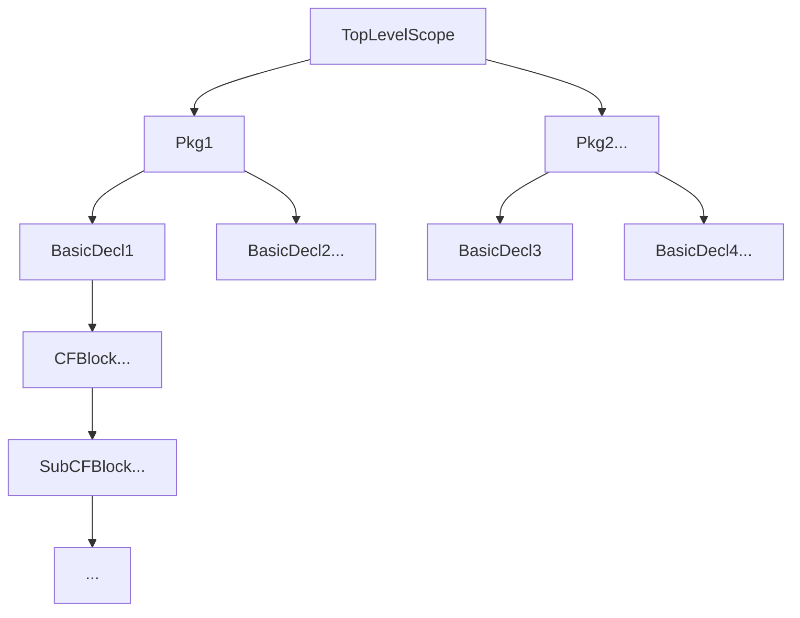

# Symbol Table Design

## Introduction

Today I am intended to talk about the symbol table design of the forthcoming Ausar language. Here comes the first question: What is the symbol table? As referenced by Wikipedia page [Symbol table](https://en.wikipedia.org/wiki/Symbol_table),

> In computer science, a symbol table is a data structure used by a language translator such as a compiler or interpreter, where each identifier (or symbol), constant, procedure and function in a program's source code is associated with information relating to its declaration or appearance in the source.

Symbol table is an essential data structure in the implementation of compilers. The internal symbol table of Ausar provides such key capabilities as below:

* It stores all the variables with extended informations in one place.

  * The ultimate symbol table is a multi-level tree with a sole entrance node (The top-level node).
* It can be used to verify the redeclaration of variables.

  * A unique variable can only be declared once.
* It can be used to determine the scope of a variable.

  * Every variable is bound to a unique scope.
* It can be ultilized to implement the type checking to ensure the semantic correctness of source code.

  * A literal value cannot be assigned to a function variable.
  * Only variables can be declared and assigned.

## Key Design

### Architecture Illustration



As illustrated above, the symbol table  is a multi-level tree with only a sole entrance (the toplevel scope). The sophisticated multi-level architecture is constituted with four basic levels as its skelton, respectively,

* TopLevelScope
  * The builtin functions and packages are registered in the top level scope, which is readonly for the subsequent scopes.
* PkgScope
  * This scope holds the packages defined by users. Every package is declared in this scope with the unique package name.
* BasicDeclScope
  * Function is the first-class citizen with the distinct scope extending the package scope.
* ControlFlowScope
  * This one is instantiated by the control flow statement like `` if else`` statement and `` for`` statement. Such scopes are self-recursive which indicates that it may have sub control flow scopes.
  * ```go
    if a > b {
       if a > 3 {
       }
    } 

    ```

The architecture resembles the prototype chain in Javascript, where the declaration operation makes side effect in its own scope, while the get & set operation can affect the scopes rooted in the same extending path.

### Implementation

#### Data Structure

```go
type SymbolTable struct {
	p *SymbolTable
	a map[string]TypedValue
}

type TypedValue struct {
	IdentifierType
	Value any
}
```

The `` SymbolTable`` preserves two basic fields including a pointer ``p`` pointing to its parent ``SymbleTable`` and a map field ``a`` which holds the varaibles declared in its domained scope.

#### Basic Operations

##### Get

```go
func (s *SymbolTable) Get(name string) (TypedValue, error) {
	if val, ok := s.a[name]; ok {
		return val, nil
	} else if s.p != nil {
		return s.p.Get(name)
	}
	return TypedValue{}, fmt.Errorf("variable [%s] not declared", name)
}
```

The `` Get`` operatation follows a recursive and ascent strategy to look up the target variable. At first, it searches the variable in the local scope, and returns the value if it exists. If the variable does not exists, it tries to call the ``Get`` method of its parent symbol table.

##### Set

```go
func (s *SymbolTable) Set(name string, iType IdentifierType, val any) error {
	if curVal, ok := s.a[name]; ok {
		if curVal.IdentifierType != iType {
			return fmt.Errorf("iType not equal: want [%v], cur [%v]", curVal.IdentifierType, iType)
		}
		s.a[name] = NewTypedValue(iType, val)
		return nil
	} else if s.p != nil {
		return s.p.Set(name, iType, val)
	}
	return fmt.Errorf("variable [%s] not declared", name)
}

```

As the same as the ``Get`` operation, the `` Set`` operation endevors to operate the local scope if the variable has been declared. Or else, it tries to trigger the `` Set`` method of its parent symbol table.

##### Declare

```go
func (s *SymbolTable) Declare(name string, iType IdentifierType, value any) error {
	if _, ok := s.a[name]; ok {
		return fmt.Errorf("variable [%s] has declared", name)
	}
	s.a[name] = NewTypedValue(iType, value)
	return nil
}
```

As illustrated above, the declaration operation could make side effects in its own scope.

## Conclusion

The symbol table of the Ausar language is simple and robust, which implements the majority of the basic features of a standard symbol table.
